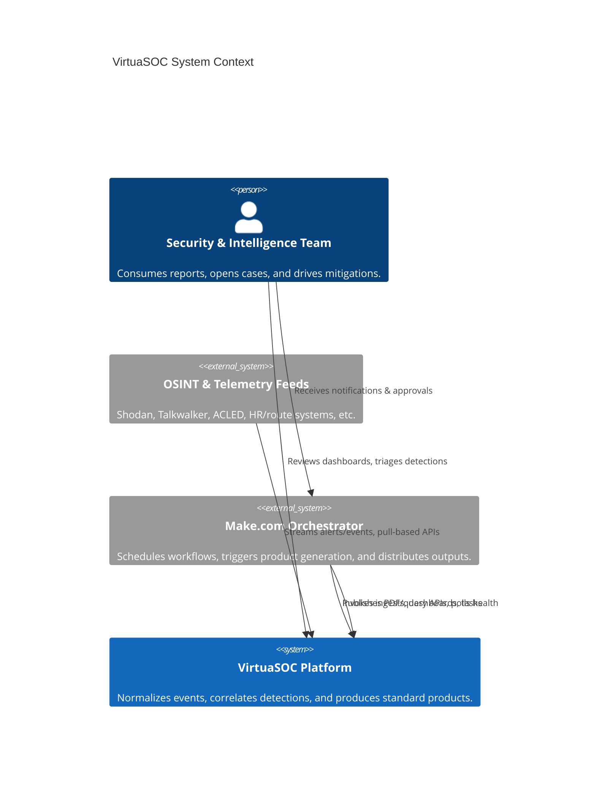
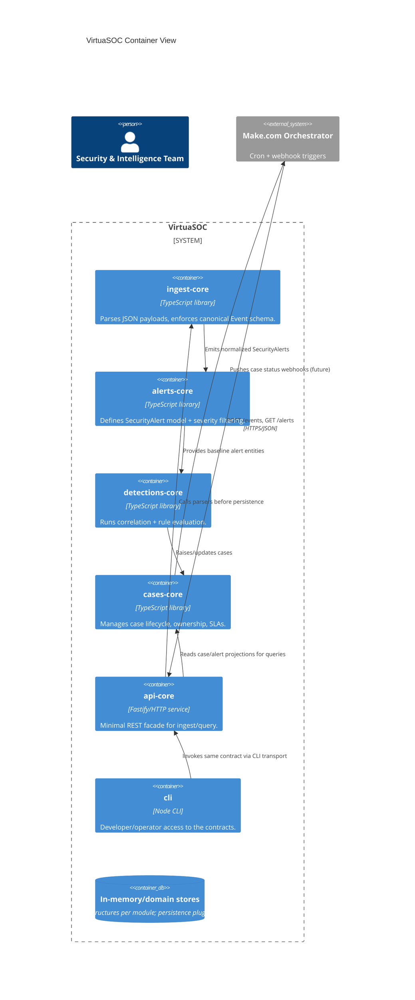

# VirtuaSOC Architecture

VirtuaSOC automates the production of standardized intelligence deliverables for
physical and cyber security teams. This document captures the live system
architecture, the C4 context and container views, and the module boundaries that
govern work inside `app/modules/**`.

## System Context (C4 Level 1)

Key points:
- VirtuaSOC is data-plane only; orchestrators own scheduling and final delivery.
- External feeds are treated as untrusted input and pass through strict schema
  validation prior to storage or correlation.

## Container View (C4 Level 2)

## Module Boundaries

| Module        | Responsibility                                                     | Dependencies                        |
|---------------|-------------------------------------------------------------------|-------------------------------------|
| `alerts-core` | Pure domain model for `SecurityAlert` + severity utilities.        | None (base layer).                  |
| `ingest-core` | Canonical event types and JSON parsers/validators.                 | `alerts-core` types.                |
| `detections-core` | Rule interface, correlation helpers, burst/threat logic.      | `alerts-core`, `ingest-core`.       |
| `cases-core`  | Case lifecycle, ownership, SLA timers, linkage to alerts.          | `alerts-core`, `detections-core`.   |
| `api-core`    | REST boundary for ingest/query; hosts schema validation.           | `ingest-core`, `alerts-core`, `cases-core`. |
| `cli`         | Operator tooling that shells into `api-core` contracts.            | `api-core` contract only.           |

Rules:
- Modules live in `app/modules/<name>` with `SPEC.md`, `CONTRACT.md`, `src/`,
  `tests/`, and `docs/`.
- Only depend inward (higher modules can consume lower ones; reverse is
  forbidden). Keep business logic pure and side-effect-free until API/integration
  surfaces.
- Each module owns its data contracts; sharing happens through explicit exports
  and versioned semantic changes.

## Data & Control Flow

1. **Ingest:** External events enter through `api-core`, which invokes
   `ingest-core` to validate and produce canonical events.
2. **Alerting:** Valid events transition into `alerts-core` models. Severity
   filters keep the data plane small and deterministic.
3. **Detection:** `detections-core` evaluates correlation rules, raising findings
   linked to original alerts/events.
4. **Case Management:** `cases-core` materializes incidents, tracks assignments,
   and exposes projections for downstream delivery (Notion, PDFs, etc.).
5. **Delivery:** Orchestrators query `api-core` or the CLI for data slices, then
   render per-product templates outside VirtuaSOC.

## Quality Attributes & Guardrails

- **Security-first:** All inbound payloads must pass schema validation before any
  business logic runs (see `ingest-core`). Sensitive artifacts never leak to logs.
- **Testability:** Modules keep IO at the edges, enabling fast Vitest suites.
- **Traceability:** ADRs capture architectural shifts; diagrams stay synced with
  the backlog-driven roadmap.
- **Deployability:** Containers are library-first; runtime surfaces (`api-core`,
  `cli`) use the same contracts, ensuring deterministic behavior.

## Future Work

The roadmap (see `ai/BACKLOG.md`) adds ingest, detection, cases, API, and CLI
modules. This architecture document should evolve alongside each addition,
keeping the C4 diagrams and boundary tables current.

