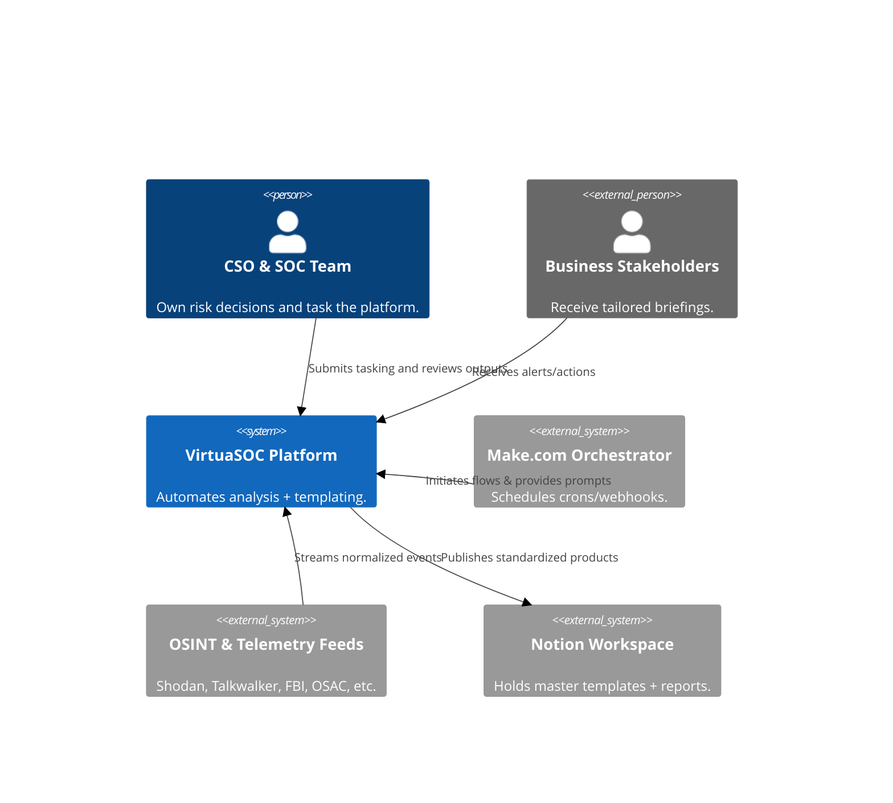
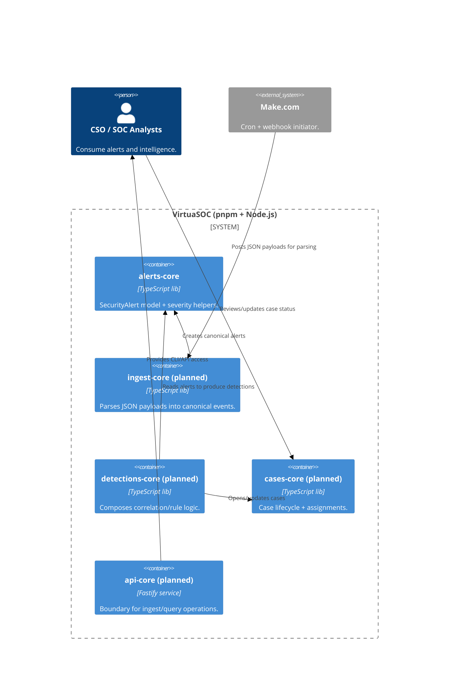

# VirtuaSOC Architecture

VirtuaSOC automates the production of intelligence products by normalizing
diverse OSINT feeds, applying security analytics, and publishing templated
reports into Notion. The system is grown incrementally through isolated modules
living under `app/modules/*`.

## C4 Context

**Key interactions**
- OSINT sources push raw events that VirtuaSOC must normalize before analytics.
- Make.com orchestrates scheduling but never touches business logic; it only
  invokes module contracts (e.g., ingest, detections).
- Analysts review finished products in Notion and supply follow-up tasking.

## C4 Container (Logical)

**Container responsibilities**
- `alerts-core` is the single source of truth for the `SecurityAlert` shape,
  severity levels, and baseline filtering logic. All upstream/downstream modules
  depend on it but it stays pure and IO-free.
- Future ingest/detection/case/api modules live in the same repo but only talk
  to each other through documented contracts to keep blast radius small.
- `Make.com` remains an external automation boundary that exercises module APIs
  via HTTP/CLI without embedding business logic.

## Module guardrails

- Each module owns its documentation capsule (`SPEC.md`, `CONTRACT.md`,
  `src/`, `tests/`, `docs/`). Anything crossing module boundaries must be
  represented as TypeScript types exported from `CONTRACT.md`.
- Dependencies flow inbound toward the core. `alerts-core` exposes domain types,
  ingest uses those types to publish alerts, detections consumes them to raise
  cases, and `api-core` gates any IO.
- Tests must cover both happy-path and guard-rail behavior (e.g., invalid
  severity handling) before a module is considered ready for integration.

See [ADR-0001](../adr/ADR-0001-initial-architecture.md) for module boundary and
pattern decisions, and [ADR-0002](../adr/ADR-0002-alerts-core-design.md) for the
alerts core design.

