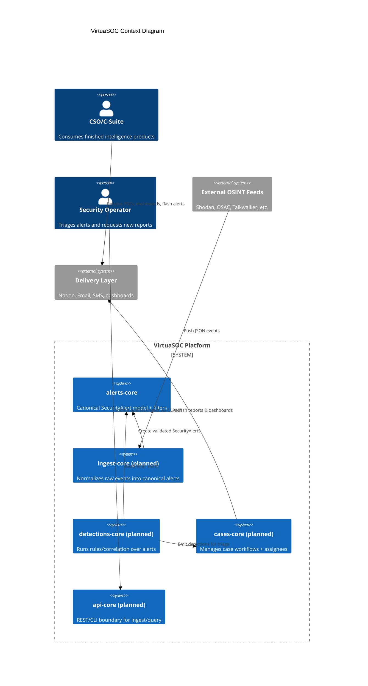
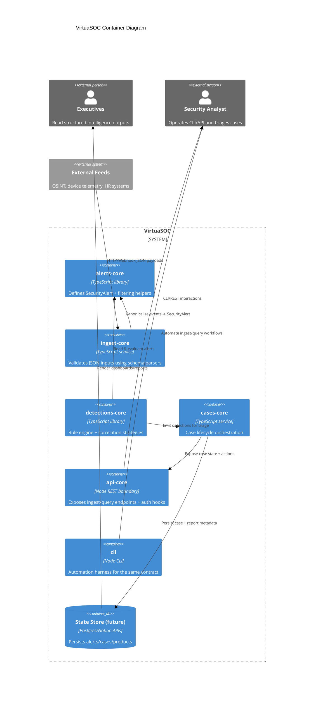

# VirtuaSOC Architecture

VirtuaSOC automates the production of standardized intelligence products by
composing small, contract-driven modules. This document captures the current
system context and container-level design using the C4 model (rendered as
Mermaid diagrams), then details the interaction rules that keep the platform
safe to extend.

## Guiding Principles

- Hexagonal boundaries: every module owns its data model and interaction
  contract.
- Pure core: `alerts-core` contains only deterministic logic so it can be used
  everywhere (ingest, detections, cases) without side effects.
- Narrow interfaces: upper layers consume lower layers via TypeScript types and
  functional helpers exported from each module's `src/index.ts`.

## C4 Level 1 — System Context

### Context Highlights

- External OSINT feeds and Make.com automations flow into `ingest-core` and must
  be schema-validated before becoming alerts.
- `alerts-core` is the shared contract that downstream modules rely on.
- Operators interact through `api-core`/`cli`; executives only see curated
  outputs via delivery systems.

## C4 Level 2 — Container View

### Container Highlights

- Contracts flow inward: only `alerts-core` sits at the center and has no
  dependencies on higher-level services.
- `ingest-core` and `detections-core` are pure logic containers that can run in
  any orchestrator (Make.com, workers, CLI) because they avoid IO directly.
- `cases-core` and `api-core` are the only places where persistence and auth
  logic are allowed; they wrap the lower layers to keep compliance boundaries
  clear.

## Module Responsibilities & Interaction Rules

| Module | Responsibility | Interaction Constraints |
| --- | --- | --- |
| `alerts-core` (implemented) | Owns `SecurityAlert`, `Severity`, and pure helper functions. | Performs no IO; exports types/functions through `src/index.ts`. |
| `ingest-core` (planned) | Validates JSON payloads, enriches metadata, emits canonical alerts. | May depend on shared validation utilities but never on higher layers. |
| `detections-core` (planned) | Hosts rule interfaces and simple correlations (burst-by-source/IP). | Consumes only the `alerts-core` contract; outputs typed findings. |
| `cases-core` (planned) | Case lifecycle (open → triage → closed) plus assignment metadata. | Reads detections via typed events; publishes case actions for delivery. |
| `api-core` (planned) | REST surface for ingest/query with stub-auth boundary. | Only exposes contracts already defined in module `CONTRACT.md` files. |
| `cli` (planned) | Automation harness that mirrors `api-core` contracts for ops tooling. | Calls into the same module exports as `api-core`; no private hooks. |

Additional rules:

1. Dependencies point inward. Higher layers (`api-core`, `cases-core`) can depend
   on lower layers (`alerts-core`, `ingest-core`) but never the reverse.
2. Cross-module communication happens strictly via the functions/types declared
   in each module's `CONTRACT.md`.
3. Shared utilities (validation, redaction, logging) live in their own modules
   to avoid tight coupling or leaky abstractions.

## References

- [ADR-0001](../adr/ADR-0001-initial-architecture.md) — module boundaries and
  architecture patterns.
- [ADR-0002](../adr/ADR-0002-alerts-core-design.md) — `alerts-core` design
  details.
