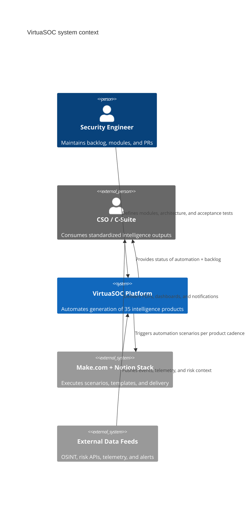

# VirtuaSOC Architecture

VirtuaSOC is an autonomous pipeline that turns OSINT feeds into standardized
intelligence products. The repository captures the domain model (TypeScript
modules, contracts, and tests) while Make.com/Notion automations orchestrate
data pulls, drafting, and delivery. This document records the system view using
the C4 model so new modules can be added safely.

## C4 Level 1 – System Context

VirtuaSOC sits between external data sources and the executives who consume the
finished products. Security engineers interact with the repository to evolve
modules, while Make.com scenarios execute the operational workflows.



## C4 Level 2 – Container View

The container view highlights how the repository, autonomous modules, and
automation stack collaborate. Each module lives in `app/modules/<name>` and is
captured by SPEC, CONTRACT, implementation, tests, and docs.

```mermaid
C4Container
    title VirtuaSOC containers
    Person(analyst, "Security Engineer")
    Person_Ext(csuite, "CSO / C-Suite")

    System_Boundary(vsoc, "VirtuaSOC Platform") {
        Container(repo, "Autopilot Monorepo", "Node.js + TypeScript + pnpm",
            "Backlog, ADRs, architecture, and module capsules")
        Container(alertsCore, "alerts-core", "TypeScript library",
            "Defines SecurityAlert + severity utilities")
        Container(ingestCore, "ingest-core (planned)", "TypeScript library",
            "Canonical event ingestion + strict JSON parsing")
        Container(detectionsCore, "detections-core (planned)", "TypeScript library",
            "Rule interfaces + basic correlation utilities")
        Container(casesCore, "cases-core (planned)", "TypeScript library",
            "Case lifecycle + assignments")
        Container(apiCore, "api-core (planned)", "Node HTTP surface",
            "REST ingest/query boundary consuming module contracts")
        Container(cli, "cli (planned)", "Node CLI",
            "Operator tooling that calls api-core contracts")
    }

    System_Ext(make, "Make.com + Notion", "Automation fabric, templating, delivery")
    System_Ext(feeds, "External Data Feeds", "OSINT, ACLED, Talkwalker, Shodan, etc.")

    Rel(analyst, repo, "Adds backlog items, ADRs, and code")
    Rel(repo, alertsCore, "Exports contracts + pure domain logic")
    Rel(alertsCore, ingestCore, "Provides alert model reused during ingestion")
    Rel(ingestCore, detectionsCore, "Supplies normalized events")
    Rel(detectionsCore, casesCore, "Raises cases when detections fire")
    Rel(apiCore, make, "Exposes REST hooks the automation stack can call")
    Rel(cli, apiCore, "Invokes API for local workflows")
    Rel(make, csuite, "Delivers finalized products")
    Rel(feeds, ingestCore, "Stream raw events that must be normalized")
```

## Module Responsibilities

- `alerts-core`: Current, production-ready module that holds the `SecurityAlert`
  type and severity filtering. It is pure, deterministic, and requires no IO.
- `ingest-core` (planned): Owns canonical event schemas, input validation, and
  redaction so downstream modules receive trusted data.
- `detections-core` (planned): Hosts detection rules and correlation helpers
  such as burst by source/IP logic.
- `cases-core` (planned): Manages case life cycle (open → triage → closed) and
  assignments for analysts or automation owners.
- `api-core` / `cli` (planned): Thin delivery surfaces that expose the module
  contracts via REST and CLI for automation and human interaction.

## Data and Control Flow

1. External feeds emit telemetry that `ingest-core` will normalize using the
   contracts defined in this repo.
2. Normalized events move through detection logic, which reuses `alerts-core`
   types to express severity and produce actionable alerts.
3. Cases aggregate related alerts, link to Notion pages, and hand off to
   automation or human analysts.
4. Make.com/Notion orchestrations pull from API/CLI boundaries to render the
   35 standardized intelligence products and deliver them to executives.

## Architectural Guardrails

- Every module is a capsule with SPEC, CONTRACT, implementation, tests, and docs
  under `app/modules/<module>/`.
- Contracts are frozen once published; other modules only depend on contracts,
  never on internal files.
- Modules stay pure and IO-free until they intentionally cross a boundary (API,
  CLI, or automation). Security-sensitive duties such as validation and
  redaction live close to ingestion modules to prevent tainted data downstream.

